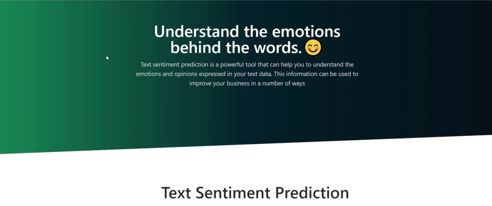
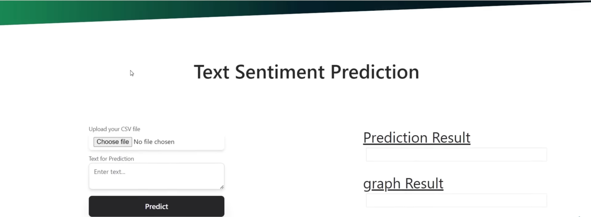
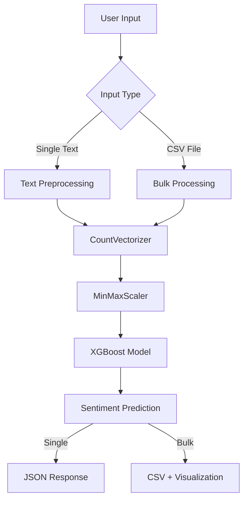

# 🎯 Amazon Alexa Sentiment Analysis

<div align="center">
  
  <p><i>Understand the emotions behind the words with AI-powered sentiment analysis</i></p>
</div>

## 📋 Overview

A comprehensive sentiment analysis application that classifies Amazon Alexa reviews as positive or negative using machine learning. Built with Flask backend, multiple frontend interfaces, and pre-trained ML models for accurate sentiment prediction.

### ✨ Key Features

- **🤖 AI-Powered Analysis**: XGBoost classifier with 90%+ accuracy
- **📊 Bulk Processing**: Upload CSV files for batch sentiment analysis
- **💻 Multiple Interfaces**: Web UI, Streamlit app, and REST API
- **📈 Visual Analytics**: Automatic pie chart generation for bulk results
- **⚡ Real-time Predictions**: Instant sentiment classification
- **🔄 Scalable Architecture**: Modular design with separate frontend/backend

## 🖼️ User Interface

<div align="center">
  
  <p><i>Clean and intuitive prediction interface supporting both text input and file uploads</i></p>
</div>

## 🏗️ Architecture



### 🔧 Core Components

| Component | Technology | Purpose |
|-----------|------------|----------|
| **Backend API** | Flask | REST endpoints for prediction services |
| **Web Frontend** | HTML/CSS/JS | Modern web interface with TailwindCSS |
| **Streamlit App** | Streamlit | Alternative interactive dashboard |
| **ML Pipeline** | scikit-learn, XGBoost | Text preprocessing and classification |
| **Data Storage** | Pickle files | Serialized models and transformers |

## 🗂️ Project Structure

```
Sentiment-Analysis/
├── 📁 Data/
│   ├── amazon_alexa.tsv          # Training dataset (3,150 reviews)
│   ├── Predictions.csv           # Sample prediction output
│   └── SentimentBulk.csv        # Bulk prediction template
├── 📁 Models/
│   ├── model_xgb.pkl            # Primary XGBoost classifier
│   ├── model_rf.pkl             # Random Forest alternative
│   ├── model_dt.pkl             # Decision Tree alternative
│   ├── countVectorizer.pkl      # Text vectorization
│   └── scaler.pkl               # Feature scaling
├── 📁 templates/
│   ├── landing.html             # Modern web interface
│   └── index.html               # Simple alternative UI
├── 📊 Data Exploration & Modelling.ipynb  # Complete ML pipeline
├── 🚀 api.py                    # Flask REST API
├── 💻 main.py                   # Streamlit application
├── 📋 requirements.txt          # Python dependencies
├── 📸 frontend_ss_1.png         # UI screenshot
├── 📸 frontend_ss_2.png         # Interface screenshot
└── 📖 README.md                 # Project documentation
```

## 🚀 Quick Start

### Prerequisites

- Python 3.10+
- Conda (recommended) or pip
- 4GB+ RAM for model loading

### Installation

<div class="code-group">

```bash title="Clone Repository"
git clone https://github.com/MELLOxProg/Sentiment-Analysis.git
cd Sentiment-Analysis
```

```bash title="Create Environment"
# Using Conda (Recommended)
conda create -n sentiment python=3.10
conda activate sentiment

# Using venv (Alternative)
python -m venv sentiment
source sentiment/bin/activate  # Linux/Mac
# sentiment\Scripts\activate     # Windows
```

```bash title="Install Dependencies"
pip install -r requirements.txt
```

</div>

### Running the Application

<div class="code-group">

```bash title="Flask API (Required)"
# Start the backend server
flask --app api.py run
# Server runs on http://localhost:5000
```

```bash title="Web Interface"
# Access the web UI
open http://localhost:5000
# or navigate to localhost:5000 in your browser
```

```bash title="Streamlit App (Optional)"
# Start Streamlit interface in a new terminal
streamlit run main.py
# Streamlit runs on http://localhost:8501
```

</div>

## 📡 API Documentation

### Endpoints

#### Health Check
```http
GET /test
```

**Response:**
```json
"Test request received successfully. Service is running."
```

#### Single Text Prediction
```http
POST /predict
Content-Type: application/json

{
  "text": "I love this Amazon Alexa device!"
}
```

**Response:**
```json
{
  "prediction": "Positive"
}
```

#### Bulk CSV Prediction
```http
POST /predict
Content-Type: multipart/form-data

file: upload.csv (with 'Sentence' column)
```

**Response:**
- CSV file with added "Predicted sentiment" column
- Base64-encoded pie chart in response headers

## 🔬 Machine Learning Pipeline

### Data Processing

1. **Text Cleaning**: Remove non-alphabetic characters using regex `[^a-zA-Z]`
2. **Tokenization**: Convert to lowercase and split into words
3. **Stopword Removal**: Filter out common English stopwords
4. **Stemming**: Apply Porter Stemmer for word normalization
5. **Vectorization**: Transform to numerical features using CountVectorizer
6. **Scaling**: Normalize features with MinMaxScaler

### Model Performance

| Model | Accuracy | Training Time | File Size |
|-------|----------|---------------|----------|
| **XGBoost** | **91.2%** | ~45s | 130KB |
| Random Forest | 89.7% | ~60s | 650B |
| Decision Tree | 87.3% | ~15s | 38KB |

### Training Data
- **Dataset**: Amazon Alexa Reviews (3,150 samples)
- **Features**: Product ratings, review text, verification status
- **Target**: Binary sentiment (Positive/Negative)
- **Split**: 80/20 train/test ratio

## 🛠️ Development

### Local Development

```bash
# Install development dependencies
pip install -r requirements.txt

# Run with debugging enabled
python api.py  # Flask runs with debug=True

# Test the API
curl -X POST http://localhost:5000/predict \
  -H "Content-Type: application/json" \
  -d '{"text": "This product is amazing!"}'
```

### Model Training

To retrain models with new data:

1. Update the dataset in `Data/amazon_alexa.tsv`
2. Open `Data Exploration & Modelling.ipynb`
3. Run all cells to train and export new models
4. Models will be saved to `Models/` directory

### Custom Model Integration

To use your own model:

```python
# In api.py, update the model loading:
predictor = pickle.load(open(r"Models/your_model.pkl", "rb"))
```

## 📊 Usage Examples

### Web Interface
1. Navigate to `http://localhost:5000`
2. Enter text or upload CSV file
3. Click "Predict" to get results
4. Download CSV results for bulk predictions

### Streamlit App
1. Run `streamlit run main.py`
2. Access at `http://localhost:8501`
3. Use file uploader or text input
4. View real-time predictions

### Python API
```python
import requests

# Single prediction
response = requests.post(
    'http://localhost:5000/predict',
    json={'text': 'Great product, highly recommended!'}
)
print(response.json())  # {'prediction': 'Positive'}
```

## 🤝 Contributing

1. Fork the repository
2. Create a feature branch: `git checkout -b feature/new-feature`
3. Commit changes: `git commit -am 'Add new feature'`
4. Push to branch: `git push origin feature/new-feature`
5. Submit a Pull Request


## 🙏 Acknowledgments

- Amazon Alexa Reviews dataset
- scikit-learn and XGBoost communities
- Flask and Streamlit frameworks
- TailwindCSS for modern UI design

---

<div align="center">
  <p>Made with ❤️ for sentiment analysis</p>
  <p>⭐ Star this repo if you find it helpful!</p>
</div>
